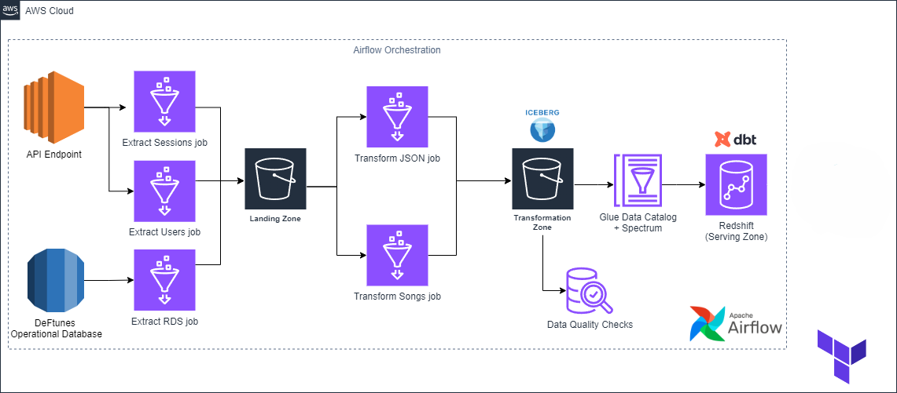
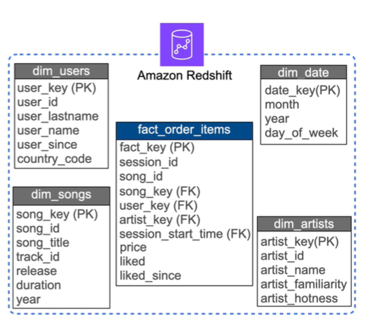
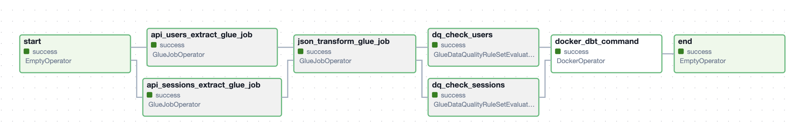
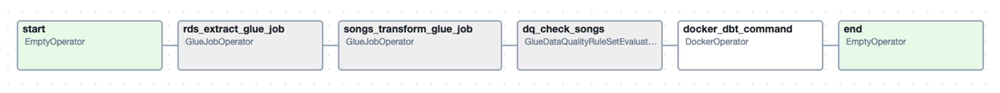

# Symphony Data Pipeline

## Overview
The Symphony Data Pipeline is a robust and scalable data engineering solution designed to process and transform large datasets into a structured format for downstream analytics. This project automates data extraction, transformation, and loading (ETL) workflows using modern data engineering tools, enabling efficient data-driven decision-making.

## Architecture


The architecture includes:
- **Data Sources:** APIs and database.
- **ETL Workflow:** Orchestrated using Apache Airflow.
- **Transformation:** Managed using dbt (Data Build Tool) for creating a dimensional model.
- **Serving Layer:** Data stored in a Redshift data warehouse for analytics.
- **Infrastructure:** Provisioned using Terraform for scalability and reproducibility.

## Tech Stack
- **Orchestration:** Apache Airflow
- **Data Modeling:** dbt
- **Data Warehouse:** Amazon Redshift
- **Infrastructure as Code (IaC):** Terraform
- **Programming Languages:** Python, SQL
- **Others:** AWS Glue, S3

## Dataset
This project uses synthetic datasets to simulate a music streaming service. Key data sources include:
- **Deftunes API** for users and sessions data.
- **Song catalog database** stored in a postgres database.

## Data Model


The dimensional model includes:
- **Fact Table:** `fact_order_items`
- **Dimension Tables:** `dim_users`, `dim_date`, `dim_songs`, `dim_artists`

These tables enable analysis such as user behavior, song popularity, and revenue insights.

## Key Features
1. **Automated ETL Workflows:**
   - Airflow DAGs to schedule and monitor data pipelines.
   - DAGs:
     - deftunes_api_pipeline_dag
       
       
     - deftunes_songs_pipeline_dag
       
2. **Transformations with dbt:**
   - BI views like `sales_per_artist_vw` and `sales_per_country_vw` for analytics.
3. **Infrastructure as Code:**
   - Terraform modules for Redshift, Glue jobs, and S3 bucket provisioning.

## Repository Structure
```
Symphony-data-pipeline/
├── dags/                  # Airflow DAGs for orchestration
├── dbt_modeling/          # dbt project for transformations
│   ├── models/            # dbt models and BI views
├── images/                # Architecture and DAG diagrams
├── scripts/               # Configuration and setup scripts
├── terraform/             # IaC for infrastructure provisioning
└── requirements.txt       # Python dependencies to test and debug
```

## Installation and Setup
1. Clone the repository:
   ```bash
   git clone <repository_url>
   ```
2. Install dependencies:
   ```bash
   pip install -r requirements.txt
   ```
3. Configure dbt profiles in `scripts/profiles.yml`.
4. Deploy infrastructure using Terraform:
   ```bash
   cd terraform
   terraform init
   terraform apply
   ```
5. Run the Airflow scheduler and webserver.
6. Trigger the DAGs to start the pipeline.

## Business Impact
This pipeline demonstrates:
- **Scalability:** Handles large datasets and automates repetitive tasks.
- **Efficiency:** Reduces manual effort by orchestrating ETL workflows.
- **Insights:** Enables data-driven decision-making through dimensional modeling and analytics-ready data.

## Future Enhancements
- Implement CI/CD pipelines for dbt and Airflow.
- Add monitoring and alerting for pipeline failures.
- Extend the pipeline to ingest real-time streaming data.

---
